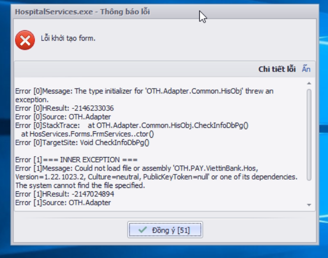

### DHG.Hospital Services - Thông tin cập nhật

(✨: Chức năng mới,🐛: Chỉnh lỗi, #️⃣: Giải quyết công việc) 

- 🐛: Lỗi gởi tự động bn điều trị nội trú có lập toa ngoại trú không thanh bhyt [OK]
- #️⃣: <https://github.com/dh-hos/dhg.hospitalservices/issues/10> [OK]

- #️⃣: <https://github.com/dh-hos/Mo-ta-he-thong/issues/11> [OK]
- ✨: Xuất NGAY_YL, NGAY_KQ theo mô tả (#11) (Vinh - Mo ta cot [dien_bien] [hoi_chan] va [phau_thuat] XML5 - 20220602.3.pdf), lấy theo ngày giờ bắt đầu và kết thúc nếu có lập phiếu phẫu thuật [OK]

- #️⃣: <https://github.com/dh-hos/Mo-ta-he-thong/issues/11> [OK]
- ✨: Cập nhật ngày giờ y lệnh trên xml 3 theo mô tả mới [OK]

- #️⃣: <https://github.com/dh-hos/DH.HIS/issues/2> [OK]
- 🐛: Bổ sung license mabvbh=77150 [OK]

- #️⃣: <https://github.com/dh-hos/Mo-ta-he-thong/issues/12> [OK]
- ✨: Thực hiện theo Mô tả thực hiện Thông tư 36/2021/TT-BYT [Mô tả](https://github.com/dh-hos/Mo-ta-he-thong/files/9553579/Vinh.-.Mo.ta.cap.phat.thuoc.nguoi.benh.Lao.theo.TT36.va.CV3153.-.17-08-2022v2.pdf) [OK]

- #️⃣: <https://github.com/dh-hos/Mo-ta-he-thong/issues/12> [OK]
- ✨: Hỗ trợ không cập nhật lại kết quả chuẩn đoán đối với bệnh nhân Lao theo Thông tư 36/2021/TT-BYT (đã ghi nhận khi in phiếu 01) khi xem XML hoặc gửi XML lên cổng BHXH [OK]
- ✨: Thực hiện theo Mô tả thực hiện Thông tư 36/2021/TT-BYT [Mô tả](https://github.com/dh-hos/Mo-ta-he-thong/files/9553579/Vinh.-.Mo.ta.cap.phat.thuoc.nguoi.benh.Lao.theo.TT36.va.CV3153.-.17-08-2022v2.pdf) [OK]
- #️⃣: <https://github.com/dh-hos/dhg.hospitaladmin/issues/21> [OK]
- ✨: Hỗ trợ xóa XML (không có chi phí gửi BHXH) trên bảng kê kiểm tra XML [OK]

- #️⃣: <https://github.com/dh-hos/dhg.hospitalprinter/issues/77> [OK]
- 🐛: Thêm chức năng xuất xml vào thư mục cấu hình trên admin khi gửi xml lên cổng BHXH đối với mabvbh=87190 [OK]

- 🐛: Fix lỗi thiếu tập tin khi mở module  [OK]
- 🐛: Fix lỗi thiếu tập tin khi mở module  [OK]

- #️⃣: <https://github.com/dh-hos/dhg.hospitaladmin/issues/23> [OK]
- 🐛: Fix lỗi không theo mô tả [Vinh.-.Mo.ta.cap.phat.thuoc.nguoi.benh.Lao.theo.TT36.va.CV3153.-.17-08-2022v2](../MoTaThayDoi/Vinh.-.Mo.ta.cap.phat.thuoc.nguoi.benh.Lao.theo.TT36.va.CV3153.-.17-08-2022v2.pdf). Xử lý chỉ cần psdangky.benhnhan_lao = 1 không cần chuẩn đoán Z22.7 sẽ thực hiện xuất xml theo MA_LYDO_VVIEN=7, MA_LOAI_KCB=7 [OK]

- ✨: Hỗ trợ xuất XML theo mô tả [MÃ HÓA HÌNH THỨC KHÁM BỆNH, CHỮA BỆNH ĐỐI VỚI BỆNH NHÂN ĐIỀU TRỊ NỘI TRÚ 4h TRỞ XUỐNG](https://github.com/dh-hos/Mo-ta-he-thong/blob/main/XML4210/Hau-Mo-ta-XML-Noi-tru-4h-3788_BYT-BH.md) [OK]
- #️⃣: <https://github.com/dh-hos/Mo-ta-he-thong/issues/18> [OK]

- ✨: Bổ sung chức năng xuất xml tự động gửi lên cổng Sở y tế Đồng Tháp (87196 - cs2 bv Thanh Bình) [OK]
- #️⃣: <https://github.com/dh-hos/dhg.hospitaladmin/issues/28> [OK]
>
- ✨: Bổ sung chức năng xuất xml tự động gửi lên cổng Sở y tế Đồng Tháp (87197 - cs2 bv Lấp Vò) [OK]
- #️⃣: <https://github.com/dh-hos/dhg.hospitaladmin/issues/29> [OK]
>
- ✨: Kiểm tra không thực hiện gửi bệnh nhân nội trú khi chưa xuất viện (xác định bằng trạng thái ravien của bệnh nhân, chỉ gửi khi trạng thái là 1) [OK]
- #️⃣: <https://github.com/dh-hos/dhg.hospitalservices/issues/15> [OK]
>
- ✨: Bổ sung xuất XML theo [Mô tả Phẫu thuật thuộc phương pháp vô cảm gây tê](https://github.com/dh-hos/Mo-ta-he-thong/blob/main/XML4210/20230415-Hau-CV1731-BHXH-G%C4%90%C4%90T-Thanh-toan-phau-thuat-vo-cam-gay-te.md) [OK]
- #️⃣: <https://github.com/dh-hos/dhg.hospitaladmin/issues/32> [OK]
>
- ✨: Bổ sung và fix lỗi theo mô tả xuất XML theo [Mô tả Phẫu thuật thuộc phương pháp vô cảm gây tê](https://github.com/dh-hos/Mo-ta-he-thong/blob/main/XML4210/20230415-Hau-CV1731-BHXH-G%C4%90%C4%90T-Thanh-toan-phau-thuat-vo-cam-gay-te.md) [OK]
- #️⃣: <https://github.com/dh-hos/dhg.hospitaladmin/issues/32> [OK]
>
- ✨: Thực hiện xuất XML3, lấy tất cả mã nhân viên chỉ định và thực hiện cận lâm sàng, ekip phẫu thuật [OK]
- #️⃣: <https://github.com/dh-hos/dhg.hospitaladmin/issues/31> [OK]
- #️⃣: <https://github.com/dh-hos/Mo-ta-he-thong/blob/main/XML4210/Vinh-Mo-ta-XML4210-XML3.MA_BAC_SI.md> [OK]
>
- 🐛: Kiểm tra trùng MA_BAC_SI trong XML3 khi lấy tất cả bác sĩ theo [Mô tả](https://github.com/dh-hos/Mo-ta-he-thong/blob/main/XML4210/Vinh-Mo-ta-XML4210-XML3.MA_BAC_SI.md) [OK]
- #️⃣: <https://github.com/dh-hos/dhg.hospitaladmin/issues/37> [OK]
